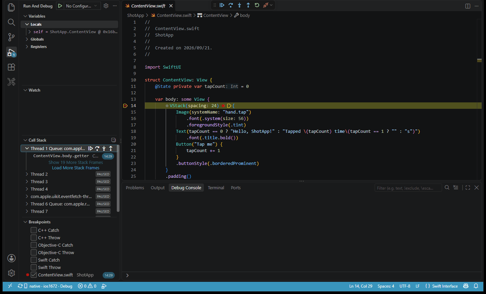
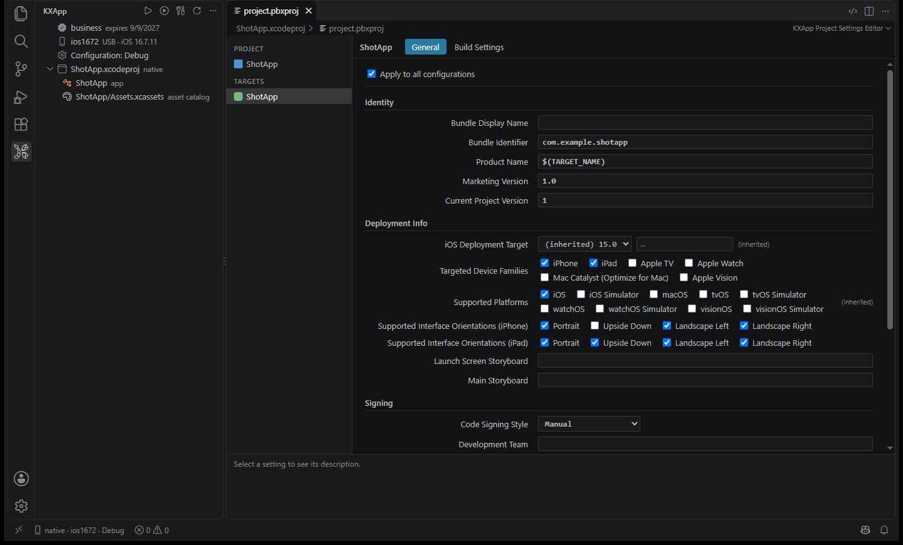
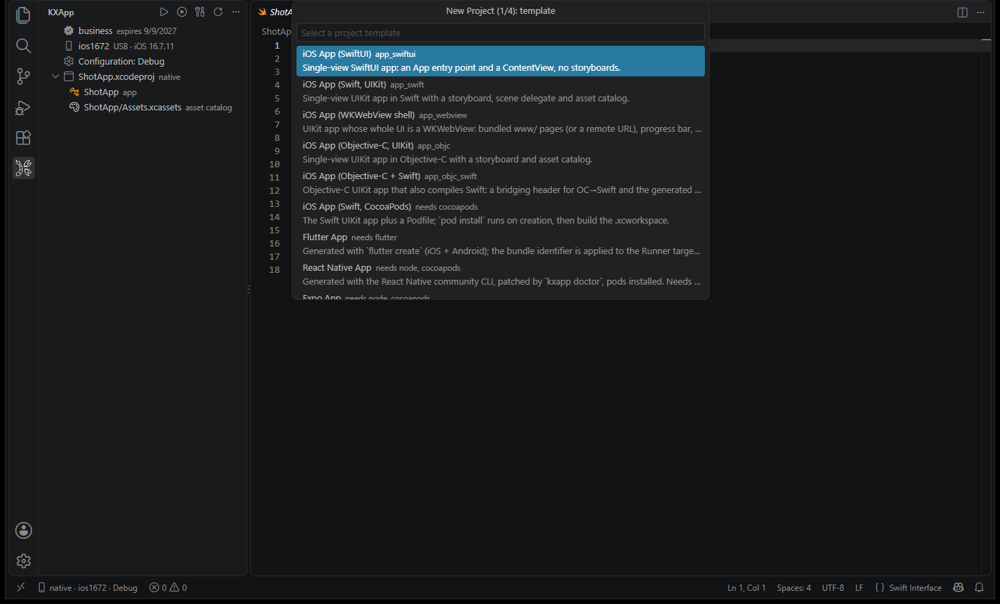

<div align="center">


# kxapp

[English](README.md) · **简体中文**

**跨平台 iOS 开发 IDE，全面开启跨平台时代**

在 Windows、Linux、macOS 上开发、真机调试、发布 iOS App。<br/>
完美兼容 Xcode 工程和 xcodebuild 命令，无需 Mac，无需安装 Xcode。

<br/>


</div>

> [!IMPORTANT]
> 🚀 **kxapp 即将正式发布！**
> 点右上角 ⭐ **Star** 或 👀 **Watch**，关注作者 **Follow**，第一时间获取发布和更新动态。
> 使用中遇到问题或有功能建议，欢迎提 [Issue](../../issues)，或加 QQ 群 **260150910** 交流。

<br/>



<p align="center"><sub>Windows 上的 VS Code，断点停在 USB 连接的 iPhone 上</sub></p>

## ✨ 亮点

| | |
|---|---|
| 🖥️ **不用 Mac** | 本机开发编译，不是虚拟机、黑苹果或云 Mac，完整的原生性能 |
| 🧩 **不用 Xcode** | 自带完整的开发工具，一条命令安装即可开始开发 |
| 📂 **工程不用改** | 已有的 Xcode 工程原样打开，处理方式与 Xcode 一致 |
| 💡 **智能提示** | 打开工程就有补全、跳转、悬停和诊断，不用先构建 |
| 🐞 **F5 真机调试** | 数据线连上 iPhone 按 F5，断点、变量、调用栈、设备日志都在 VS Code 里，Flutter 同时支持 Dart 调试 |
| 📦 **一条命令出 ipa** | Release 构建直接生成可上架 App Store 的 .ipa |
| 🔧 **兼容 xcodebuild** | 现有构建脚本和 CI 流水线原样运行 |
| 🤖 **AI 友好** | 命令支持 `--json` 输出，Copilot、Claude Code 等 AI 助手照常使用 |

## 🖥️ 支持的平台

| 系统 | 版本 | 开发 | 真机调试 | 构建发布 |
|:---:|:---:|:---:|:---:|:---:|
|  **Windows** | Windows 10 / 11 | ✅ | ✅ | ✅ |
|  **Linux** | 主流发行版 / WSL | ✅ | ✅ | ✅ |
|  **macOS** | macOS | ✅ | ✅ | ✅ |

## 🧱 技术栈支持

| 技术栈 | 编码 | 智能提示 | 真机调试 | 发布 ipa | 上架 App Store |
|---|:---:|:---:|:---:|:---:|:---:|
|  **Swift / SwiftUI / UIKit** | ✅ | ✅ | ✅ | ✅ | ✅ |
|  **Objective-C** | ✅ | ✅ | ✅ | ✅ | ✅ |
|  **C / C++** | ✅ | ✅ | ✅ | ✅ | ✅ |
|  **Swift Package** | ✅ | ✅ | ✅ | ✅ | ✅ |
|  **CocoaPods** | ✅ | ✅ | ✅ | ✅ | ✅ |
|  **Flutter** | ✅ | ✅ | ✅ | ✅ | ✅ |
|  **React Native** | ✅ | ✅ | ✅ | ✅ | ✅ |
|  **Expo** | ✅ | ✅ | ✅ | ✅ | ✅ |
| 🟢 **uni-app（HBuilderX）** | ✅ | ✅ | ✅ | ✅ | ✅ |
|  **Kotlin Multiplatform / Compose** | ✅ | ✅ | ✅ | ✅ | ✅ |
|  **Unity** | ✅ | ✅ | ✅ | ✅ | ✅ |
|  **cocos2d-x** | ✅ | ✅ | ✅ | ✅ | ✅ |
|  **Cordova** | ✅ | ✅ | ✅ | ✅ | ✅ |

各技术栈的开发步骤见 [doc/zh](doc/zh/README.md)。


## 🛠️ 在 VS Code 里做 Xcode 里的那些事

工程设置、Info.plist、资源目录、App 图标都有图形界面，保存的就是 Xcode 能打开的原文件。

| 工程设置 |
|:---:|
|  |


新工程可以从 SwiftUI、UIKit、Objective-C、Flutter、React Native、Expo 等模板起步。



## ⌨️ 命令行快速上手

例子用 Windows 路径写法，Linux / macOS 把反斜杠换成正斜杠。

### 1️⃣ 检查环境

安装后新开一个终端执行，全部通过即可。

```shell
kxapp doctor
```

### 2️⃣ 新建项目

指定模板、项目名、Bundle ID 和父目录，工程创建在 `D:\projects\MyApp`。已有工程跳过这一步。

```shell
kxapp project create -t app_swiftui -n MyApp -b com.example.myapp -o D:\projects
```

`kxapp project templates` 列出全部模板。

### 3️⃣ 设置证书

把 .p12 证书和 .mobileprovision 描述文件放进项目根目录下的 `keychain` 目录。


### 4️⃣ 编译并安装到手机

手机连上电脑，信任此电脑并打开开发者模式。加 `--install`，编译、签名、安装一次完成。

```shell
kxapp build D:\projects\MyApp\MyApp.xcodeproj --install
```

### 5️⃣ 打包发布版 ipa

换成 Apple Distribution 证书和 App Store 类型的描述文件，用 Release 配置构建。

```shell
kxapp build D:\projects\MyApp\MyApp.xcodeproj -c Release
```


生成的 `build\MyApp.ipa` 用 Transporter 或 Appuploader 上传到 App Store Connect，TestFlight 和提审流程与平时相同。

### 🔁 脚本与 CI

指定工作区和 scheme，加 `--json` 输出机器可读的进度和结果。

```shell
kxapp build ios/MyApp.xcworkspace -s MyApp -c Release --json
```

```json
{"type":"progress","phase":"CompileSwiftSources","current":12,"total":42}
{"type":"result","command":"build","data":{"success":true,"duration":"1m12s","ipa":["ios/build/MyApp.ipa"]}}
```

## ❓ 常见问题

**kxapp 是虚拟机、黑苹果还是云 Mac？**

都不是。kxapp 是一整套独立的编译工具，直接运行在你的系统上，拥有完整的原生性能。

**真机调试需要什么？**

一部 iPhone、一根数据线。手机上信任此电脑、打开开发者模式（设置 → 隐私与安全性 → 开发者模式），之后按 F5 即可。

**出的包能上架 App Store 吗？**

能。kxapp 产出的 .ipa 与 Xcode 的一致，TestFlight 和审核流程与平时相同。

## 📣 关注与反馈

<div align="center">

⭐ **Star** 本仓库　·　👀 **Watch** 获取发布通知　·　➕ **Follow** 作者即时获取动态

🐛 遇到问题或有建议？欢迎 [提交 Issue](../../issues/new)

📧 邮箱 [ikxapp@gmail.com](mailto:ikxapp@gmail.com)　·　💬 QQ 群 **260150910**

</div>
